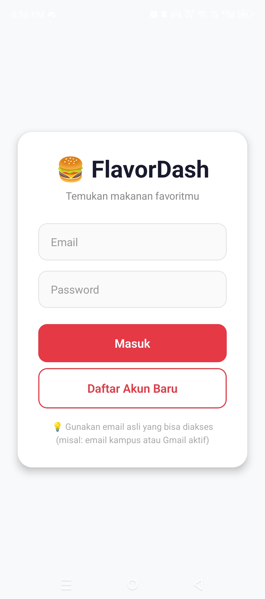
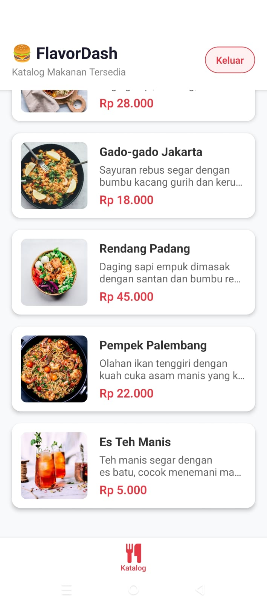
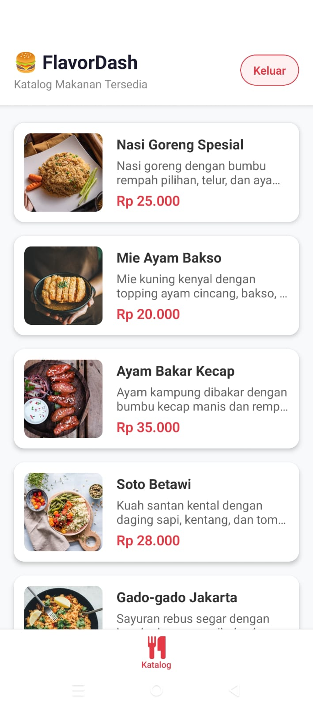

# FlavorDash - Aplikasi Katalog Makanan & Pengiriman

## 📖 Ringkasan (Summary)
FlavorDash adalah aplikasi *mobile* pengiriman makanan interaktif yang memungkinkan pengguna menelusuri katalog makanan secara responsif, mengelola detail pesanan terproteksi, serta mengambil foto bukti pengiriman dan melihat titik lokasi restoran. Proyek ini dibangun dengan fokus pada UI adaptif serta sistem keamanan yang efisien untuk platform Android maupun iOS.

## 🛠️ Stack Teknologi (Teknis)
- **Bahasa Pemrograman**: JavaScript / TypeScript
- **Framework Mobile**: React Native (berbasis Expo Go & Expo Router)
- **Database & Autentikasi API**: Supabase (Backend-as-a-Service berbasis PostgreSQL) untuk implementasi JWT *Stateless Authentication*.
- **AI Recommendation**: Penggunaan AI Agent (Antigravity / Cursor) untuk *code generation*, penyusunan alur aplikasi, dan refactoring layout *responsive*.

## 🔄 Flow Aplikasi (Garis Besar)
1. **Autentikasi (Sesi JWT):** Saat aplikasi pertama kali dibuka, *middleware* (*route protection*) secara otomatis memeriksa keberadaan token JWT Supabase. Jika belum memiliki sesi (belum login), pengguna akan diarahkan paksa ke halaman otorisasi/login.
2. **Katalog (Eksplorasi Makanan):** Setelah otentikasi berhasil, pengguna mendarat di halaman utama berupa katalog makanan. Daftar ini menggunakan tata letak *Flexbox* (row) di mana gambar produk berada berdampingan dengan teks secara proporsional.
3. **Pesanan (Detail & Tracking):** Pada tab selanjutnya, terdapat rincian pesanan eksklusif yang hanya bisa diakses akun valid, berisi ringkasan menu yang dipesan, harga total, dan status pengiriman.
4. **Bukti & Peta Lokasi:** Aplikasi menyediakan tab **Kamera** untuk langsung mengambil jepretan foto sebagai bukti pengiriman/penerimaan pesanan. Tab **Maps** melengkapi aplikasi dengan menampilkan penanda lokasi (marker) restoran di atas peta interaktif.

## 📸 Antarmuka Aplikasi (UI)

  

---

## 📊 Analisis Teknis

### Mengapa Flexbox & Ukuran Proporsional?
Penggunaan unit proporsional (`flex: 1` atau persentase) lebih disarankan daripada ukuran absolut (misal pixel) untuk menangani fragmentasi layar *mobile*. Algoritma Flexbox bekerja secara matematis membagi sisa ruang layar (*available space*). Dengan demikian, UI akan secara dinamis menyusut atau melebar tanpa menabrak batas layar (*overflow*), menjaga desain selalu proporsional dan konsisten dari HP berlayar kecil hingga besar.

### Stateful vs Stateless Authentication (JWT)
- **Stateful (Session-based):** Membebani server karena server harus mencatat status *online* dan mencari *Session ID* tiap pengguna di dalam database atau memori (RAM), sehingga penskalaan sistem menjadi lambat dan mahal.
- **Stateless (JWT-based):** Pilihan terbaik untuk aplikasi *mobile* modern. Token kredensial diserahkan secara utuh ke perangkat pengguna, sehingga server sama sekali tidak menyimpan status sesi. Server hanya perlu "memvalidasi tanda tangan kriptografi" (*signature*) token ketika ada permintaan masuk, menjadikannya sangat efisien, instan, dan mampu melayani jutaan request secara paralel.
